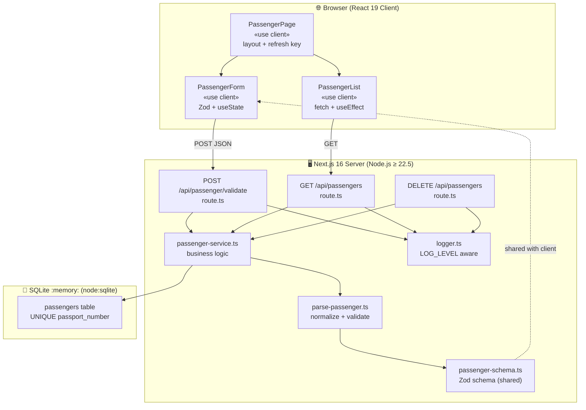
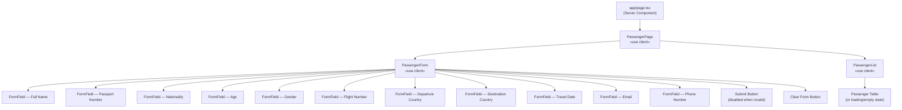
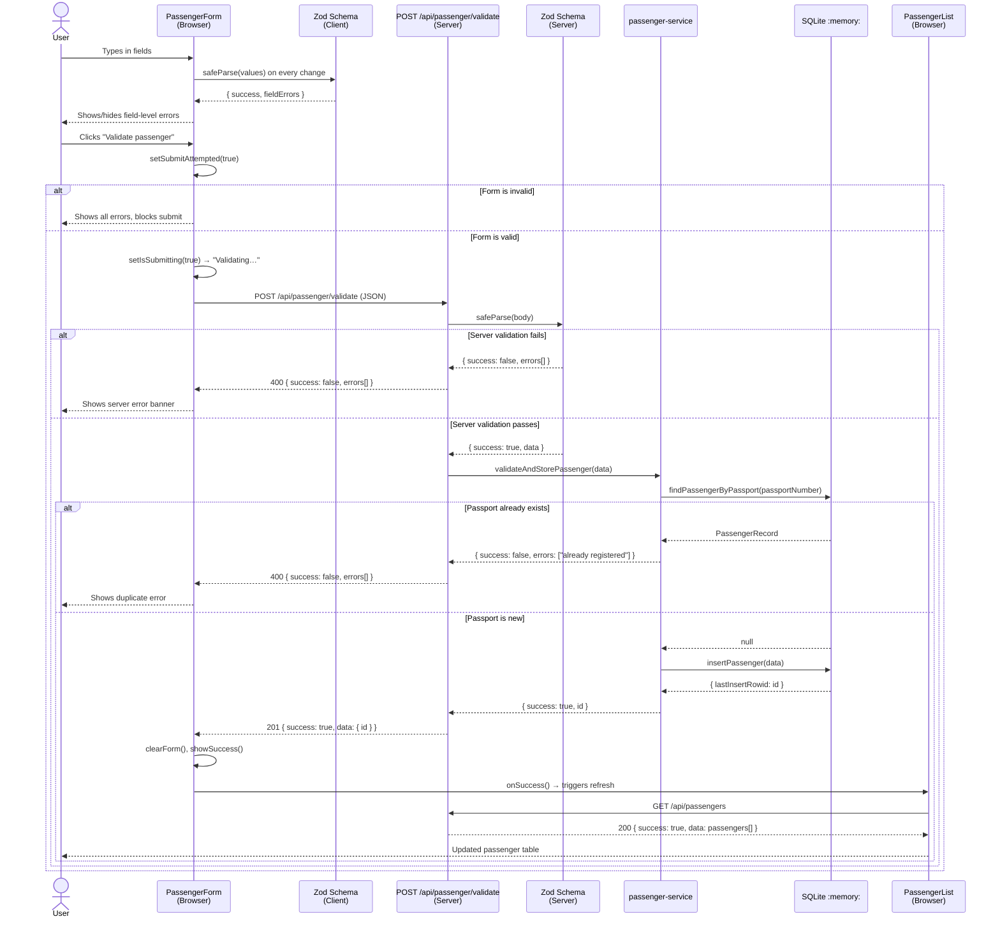
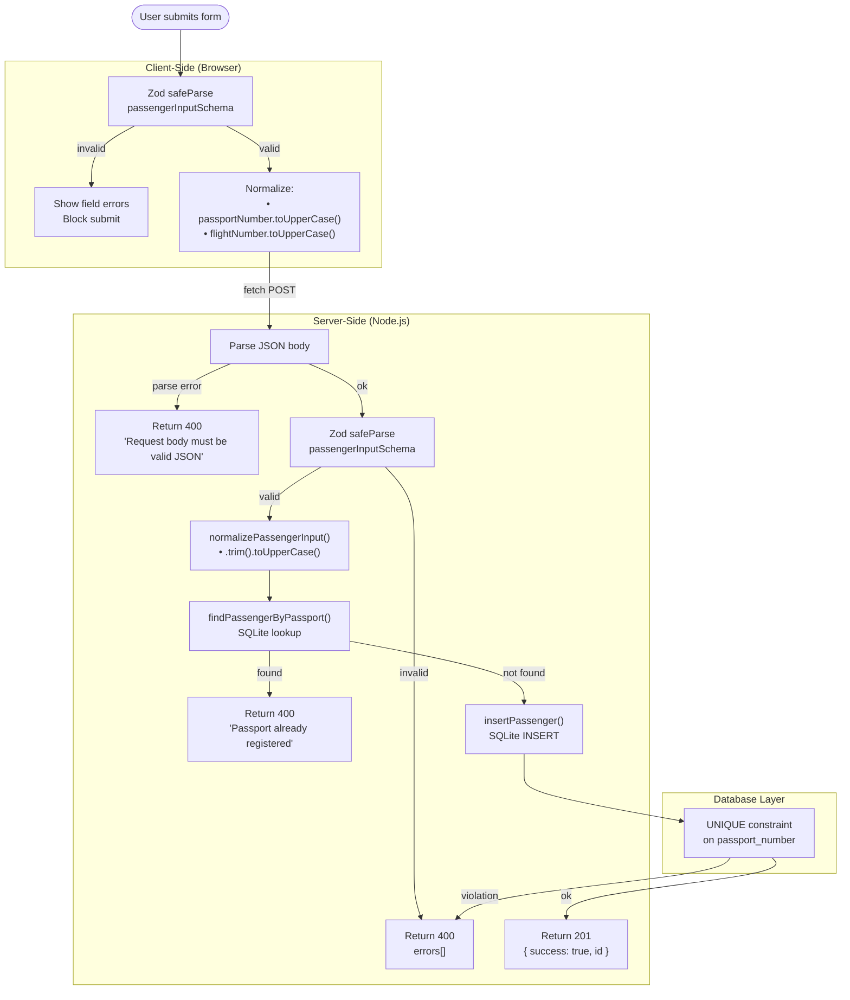
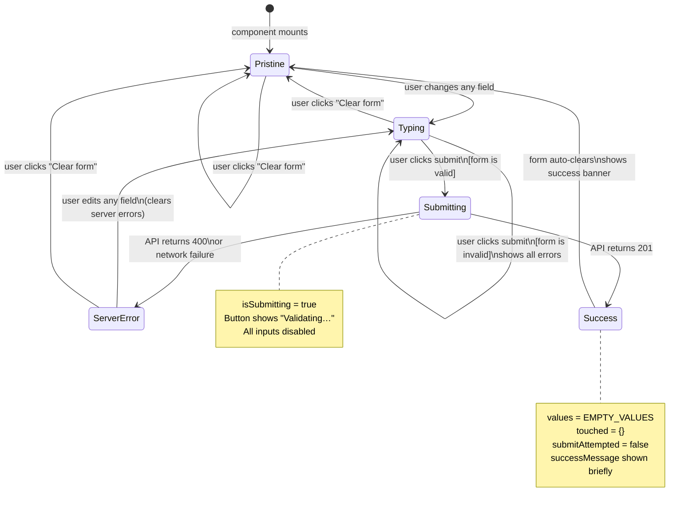
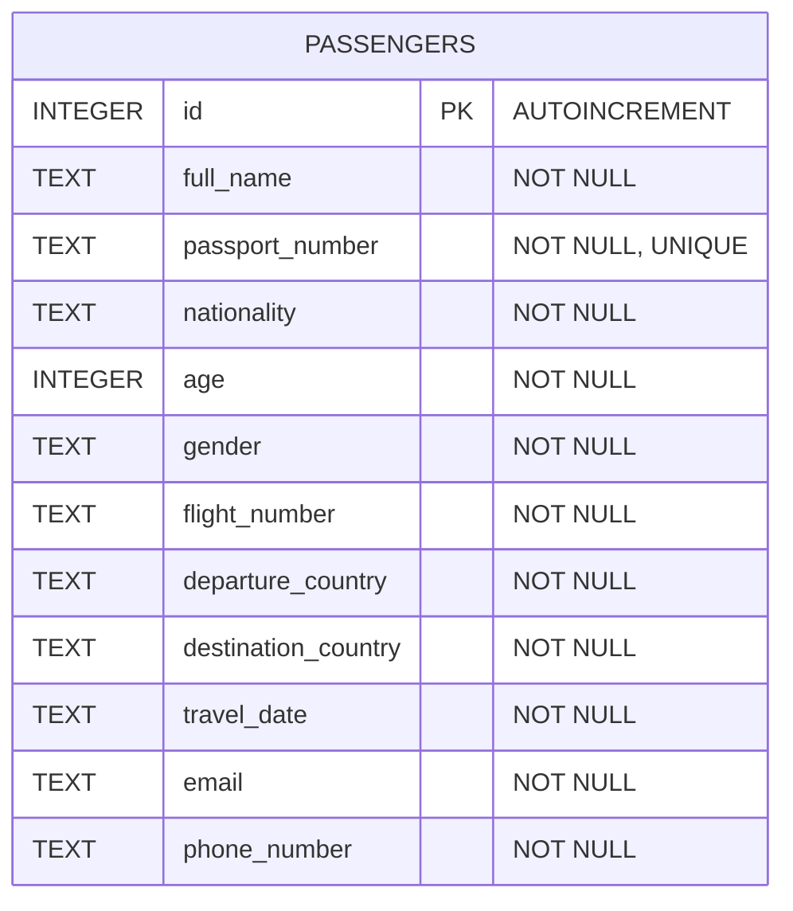
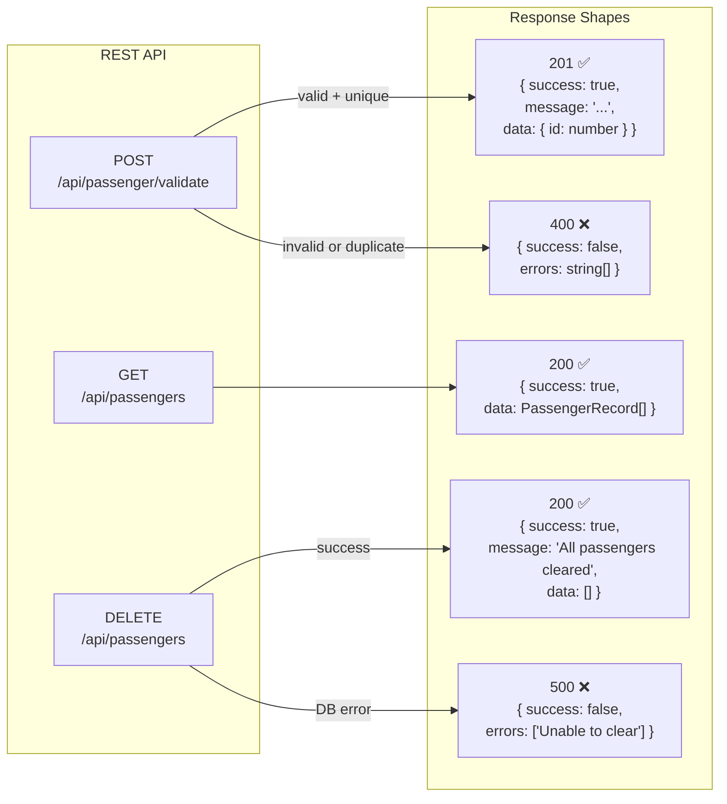
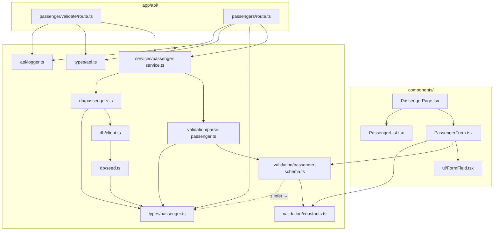

# UML Diagrams — Airline Passenger Data Validator

All diagrams are written in [Mermaid](https://mermaid.js.org/) and render natively on GitHub, GitLab, and most modern markdown viewers.

---

## Table of Contents

1. [System Architecture](#1-system-architecture)
2. [Component Tree](#2-component-tree)
3. [Request / Data Flow — Sequence Diagram](#3-request--data-flow--sequence-diagram)
4. [Validation Pipeline — Flowchart](#4-validation-pipeline--flowchart)
5. [Form State Machine](#5-form-state-machine)
6. [Database Entity-Relationship Diagram](#6-database-entity-relationship-diagram)
7. [API Endpoint Map](#7-api-endpoint-map)
8. [Module Dependency Graph](#8-module-dependency-graph)

---

## 1. System Architecture

High-level C4-style component view showing the three main layers: Browser, Next.js Server, and Database.

---

## 2. Component Tree

React component hierarchy from the root page down to individual UI elements.

---

## 3. Request / Data Flow — Sequence Diagram

End-to-end flow from user input to database insert and UI update.

---

## 4. Validation Pipeline — Flowchart

How a raw form submission is processed through all validation layers.

---

## 5. Form State Machine

State diagram of the `PassengerForm` component across its full lifecycle.

---

## 6. Database Entity-Relationship Diagram

The single-table schema with field types and constraints.

> **Note:** The schema uses a single denormalized table because this is a read/write-once demo. A production system would normalize nationality, country, and flight into separate tables with foreign keys.

---

## 7. API Endpoint Map

All HTTP endpoints, their methods, inputs, and response shapes.

---

## 8. Module Dependency Graph

How the source files import from each other. Arrows point in the direction of the import.

